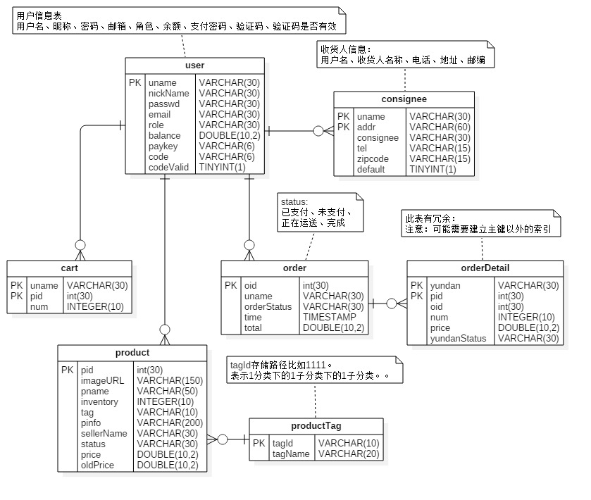
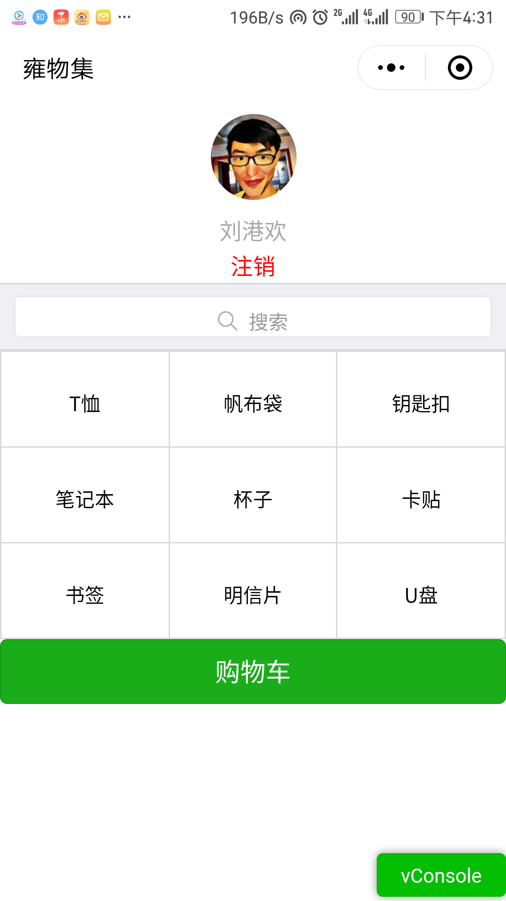
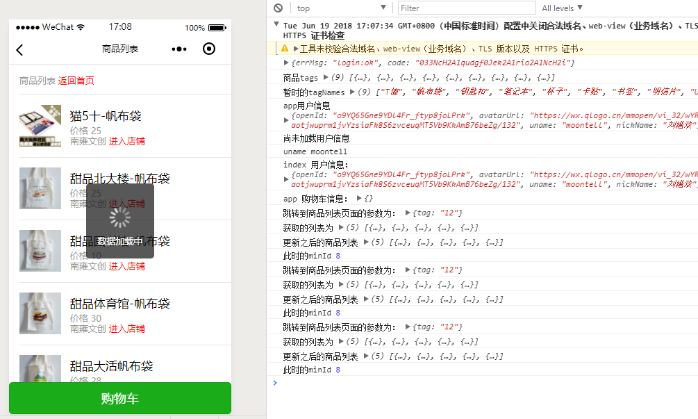
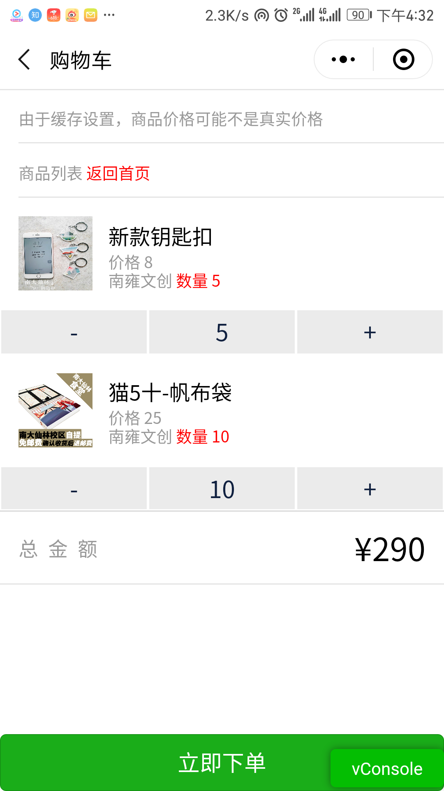
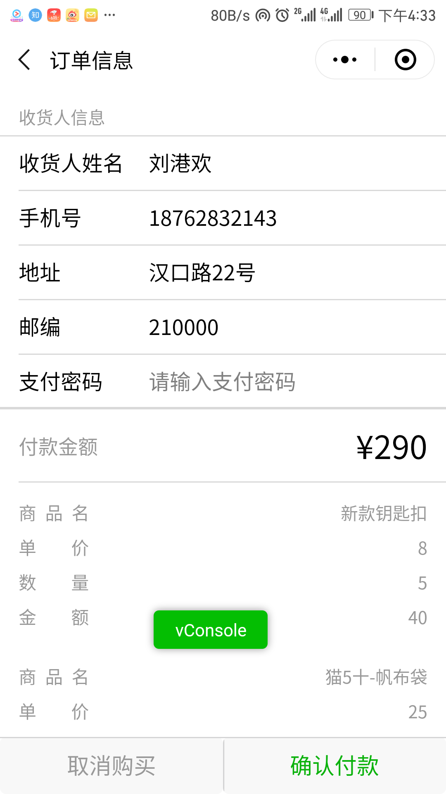
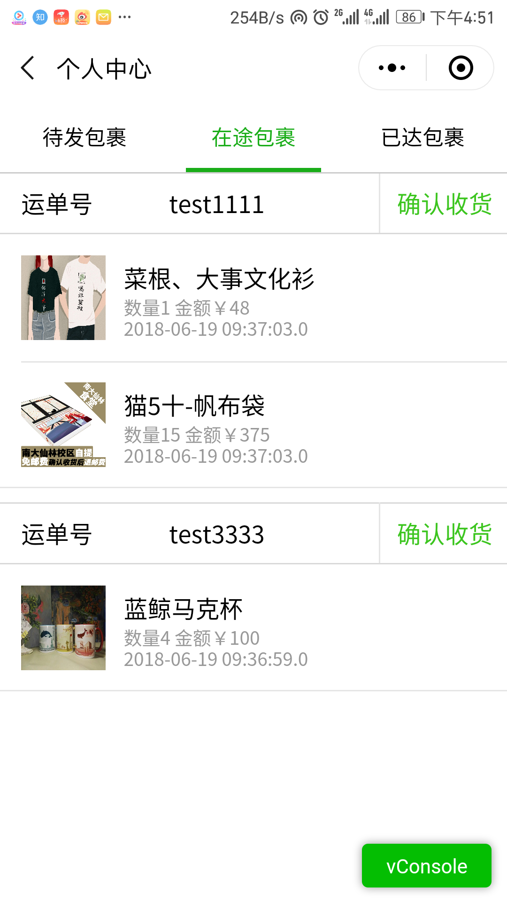
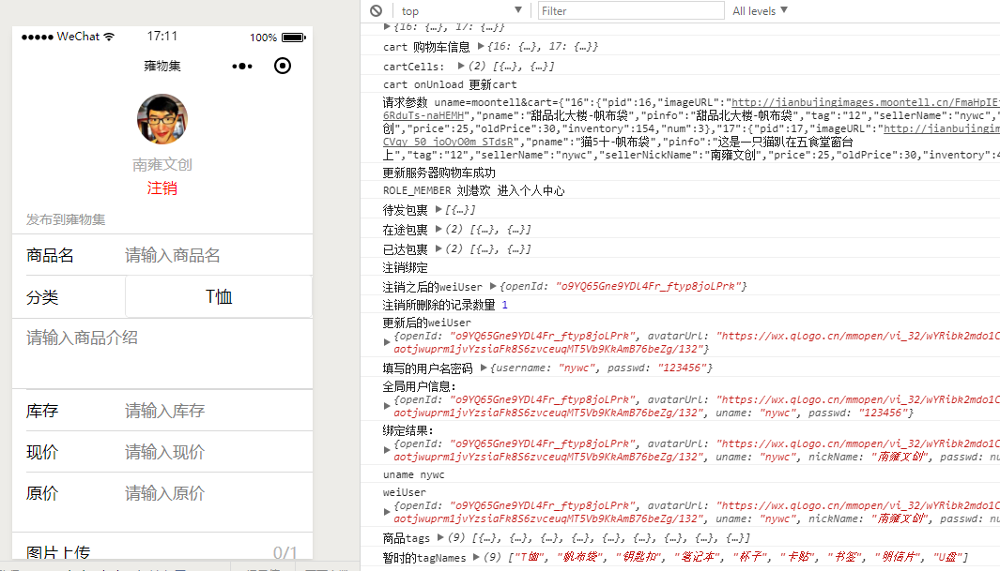
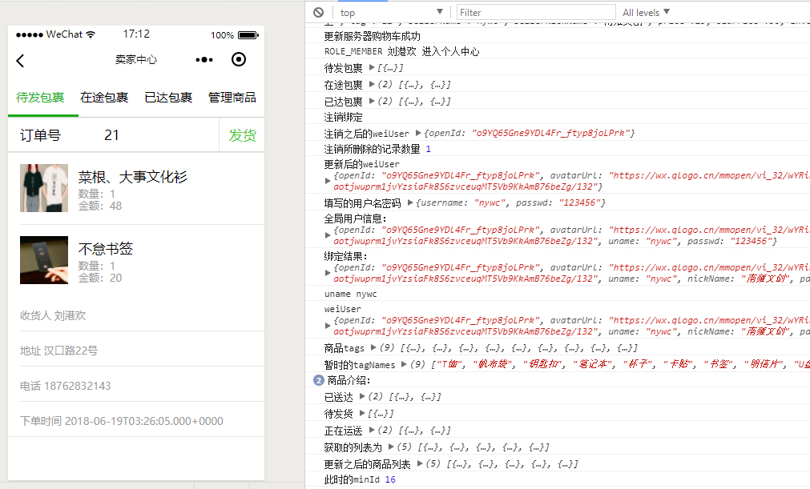
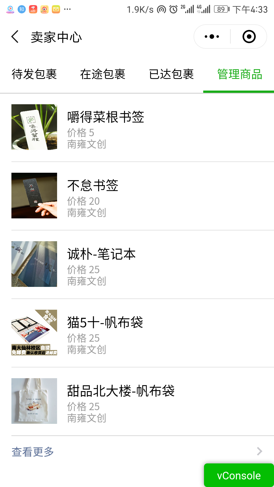
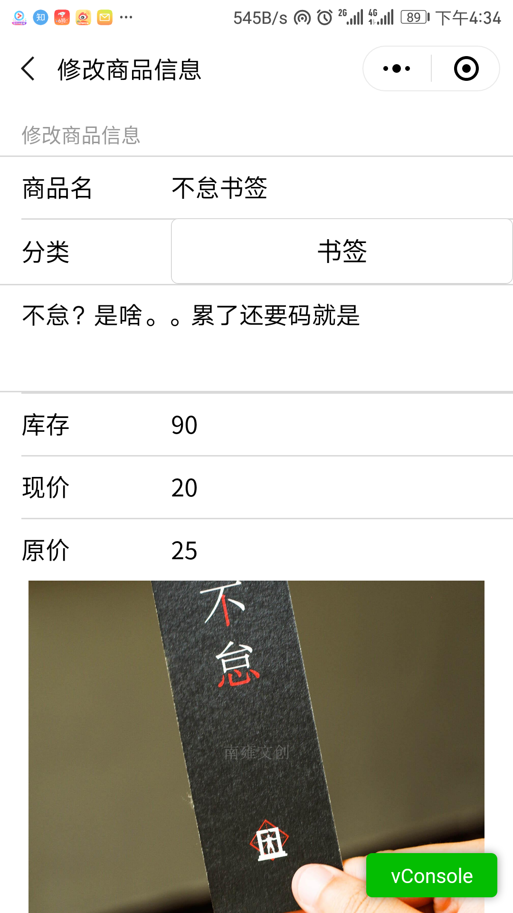

# 电子商城设计

## 技术选择

后端：springboot2.0 mybatis mysql redis

前端：微信小程序

## 数据库设计

## 截图

### 普通用户首页——提供九宫格和搜索功能，点击头像可以进入个人中心。

### 商品列表——从首页点击九宫格或者搜索都可以进入此页面

### 商品详情页面——显示价格、库存等信息，可以直接购买或者加入购物车

### 购物车页面——可以加减商品数量

### 下单页面——显示默认的收货地址（可以修改）并显示订单详情

### 用户订单页面

### 卖家首页——可以上传商品，图片使用七牛云云存储

### 卖家中心、待发包裹——显示包裹详情并可以发货

### 管理商品——可以管理自己的产品

### 修改商品信息页面

